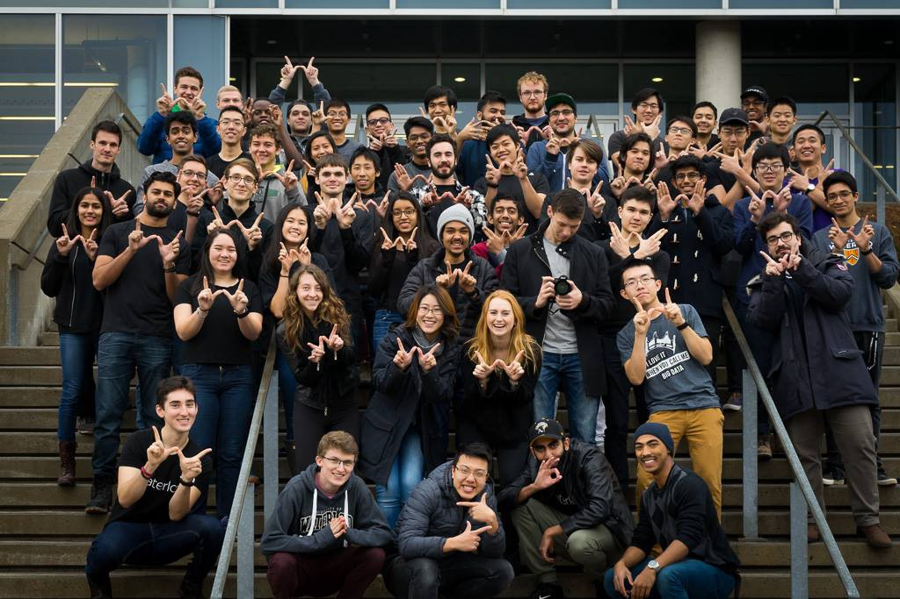
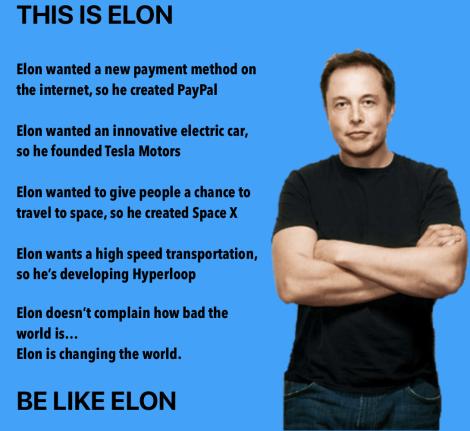
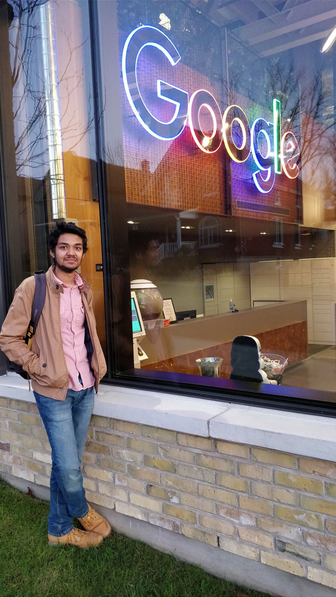
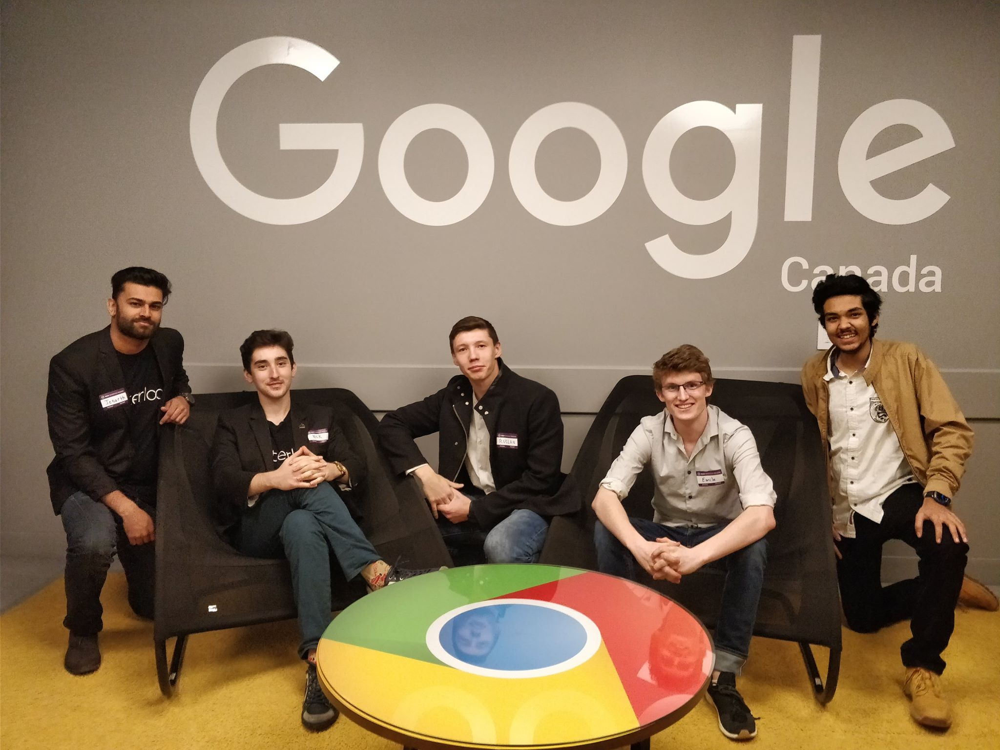

As I get ready to board my plane back home after having spent 16 weeks in Canada, 14 of which were spent in Waterloo, life has never been better.

These 16 weeks though have passed right in front of my eyes like a daze

Let's rewind and take it slow shall we?

## INDEPENDENT:
This one is major, living alone is not easy. There are some things that get easily forgotten and being on top of things is major.

This includes bills: mobile phone and credit card. Oh! Did I mention that I got a credit card? Although it has a limit it's still a <b>CREDIT CARD</b>
This also includes things like: doing Laundry - why hasn't humanity solved this yet?, using Public Transport - this one is actually nice when you're in Canada

Living independently also means that you have to deal with your shit yourself, there is no magic broom to sweep it up, but with it it also brings a sense of autonomy. The more work you do now, the less your future self will hate you.

## WATERLOOP:

So let me give some context here. The University of Waterloo has multiple Student Design Teams that are working to solve an engineering problem. This concept is common to most universities in North America.

Waterloop is a student design team that is designing the fifth mode of transportation proposed by Elon Musk.

Waterloop can take you from Toronto to Montreal or Mumbai to Goa in flat 30 minutes. So a question that you can now ask yourself is: "Where would you travel to if time wasn't a factor?"

Okay now you now that you know what Waterloop is, let me tell you what I do here: I implemented the new revamped Waterloop website (watch out for the launch on January 5!) and wait for it: became Web Lead at Waterloop.

This was the best decision ever! I have met so many new people as part of this and learnt so many new things. I also got to go Google's waterloo office, which brings me to my next topic:

## GOOGLE:
A dream since grade 10 has been to get the dream job: Software Developer @GOOGLE

My life in Canada has brought me closer thank ever to Google:

I met "real" (for some reason I thought they were "imaginary" earlier?) google employees who are doing the exact jobs that I want to do. The university also held a Technical Interview workshop hosted by none other than Google. You can check out my blog/experience: [here](https://arora-aditya.com/google-technical-interview-workshop/)

## EPIC FOOD:
So let me get this straight: I still miss Indian Food, but not to the extent of craving it every day.
I have been introduced to various new cuisines: Japanese, Mediterranean, Mexican to name a few

The added advantage of living alone is that you can choose what to eat (sorry mom) and this opens up a lot of doors for things one can try.
And as always with life in university: Pizza is key

All in all, these 112 days in Canada have been the best in my life and I can't wait for more when I return next week.
