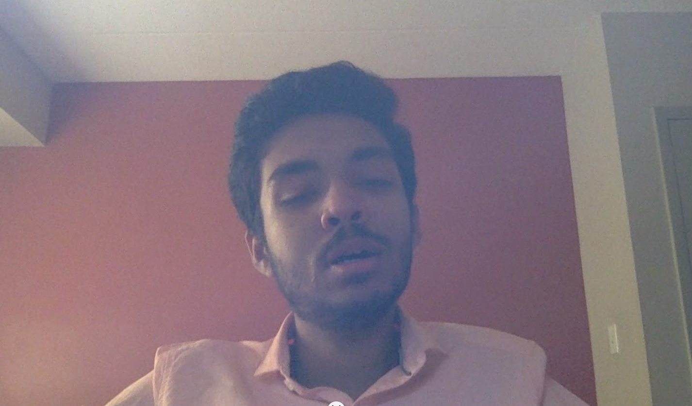
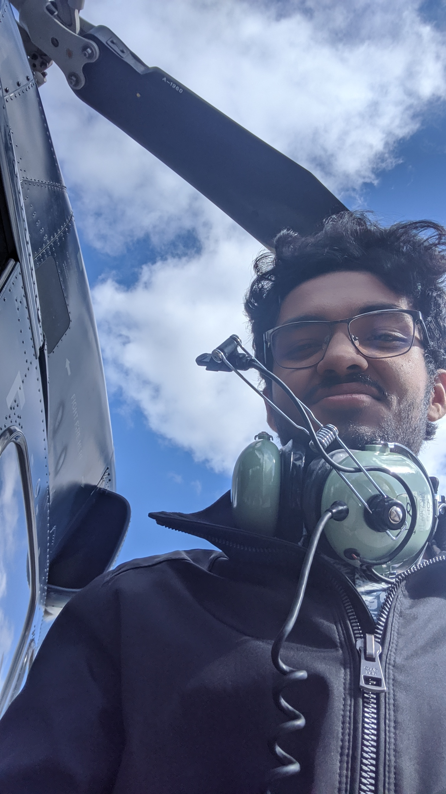

> As I turn 20 this month, there are some things that I've learnt about myself that I want to memorialize on my blog.
> 
> I wanted to remind myself of the things I've done and achieved, to shake me out of the feeling of despair when things don't always go my way. The realization for this mostly stems from the ups and downs of the last year, and the fact that I still pulled through is a cause for hope.

Last month as I was wrapping up my finals, a train of realization hit me that I officially will not be teenager anymore.

The sheer realization that I have graduated from the ranks of teens with raging hormones and crazy ideas, to a young adult was really very intense. Unfortunately though, I was immediately hit with despair, because I could feel the wave of tasks that were soon about to hit me, and I feel unprepared, mostly because I don't feel I have grown as much. Physically maybe, but emotionally I still feel like I have ways to go.

My realization about my own emotional instability stems from the rollercoaster of a year that I have had, truly incomplete without the honorable mention of fights with friends, fights with family, re-bonding with friends and family and just the pure emotion of content and discontent at the same time. All of this, while frequently getting severely sick, throughout the year, even when I was at home with my parents in August.

 In the entire grind of high-school in preparation of one exam, I feel as though, a part of my personality just got lost, that died out. <!--Another side, I feel died out when my heart was hurt, and friends betrayed late last year-->. Another part died out, when I could not convert the one company that I have been eyeing out since 7th grade sometime in July. Lastly, another part died out very recently, when I was snatched of the one thing I held very dear, my academic success in a term. 

In the entire muddle, I have felt lost, more times than I can count. More times, that I have wanted to give up. More times that I have wanted to not do anything, because the world just felt that it was revolving backwards, but just for me (My father got so frustrated with the conversation of giving up, that he forced me to talk it out with him when I went back home in late August this year) This year, has shown me that I could feel the worst I have ever felt, but still pull through, and still do and love the things that make my heart race and exclaim out loud.

This has been the year, that I have relied **extremely** on family, or more specifically my mother, to the extent, that it has become unfair for me to totally take all the attention away from my sister, who is constantly looking at her brother, just whining and often giving up just to recover and restart the cycle all over again. This has intensified, the want for someone to be more than just a friend, and instead be really really good one. One that sits around to talk, without a plan, just to talk, and relax, and get into the nitty gritty, to be the voice of rationality, in the times of absolute hopelessness and vice versa in times of need of the friend, but the search for that friend continues.  This is not in any way, meant as a diss to my current friends, but instead a kind request to share my burden a bit, and letting me share theirs.

This month, has been a month of realizations for me, realizations that run infrequent and deep. In a sense, these realizations, are driving me to become me again, and really like who I am again. To be the one, that not only gets good grades in school, but one who is more than just that, to be a better person, not just for others, but for my own sake. The detachment from good grades, is to avoid the eventuality of hard-hitting life after university, where structured projects, and a constant schedule of things will become rare, and where success won't be measured by a sheet of paper with your grades, or a semi-meaningless introduction to the Dean. In a way, this year is meant to give more meaning to life than just marks, or high performance of school, and to remind me that I could have the worst of years overall, but still come out stronger on the other side, ready to face my next challenges head on.

So in the next year, before I turn 21, there are some promises that I am going to make to myself, very publicly to keep myself accountable. These include developing a habit:
- **of fitness**: either hitting the gym, running, swimming
- **of eating healthy, and enough**: cooking, and buying
- **of reading**: books on topics that interest me - course related and otherwise
- **of writing**: reviews and blogs alike
- **of following this list**: to the T

_     If you see me on a day to day basis, I'd like to make a small request to keep me accountable by simply asking me if I'm doing good on that list of mine_