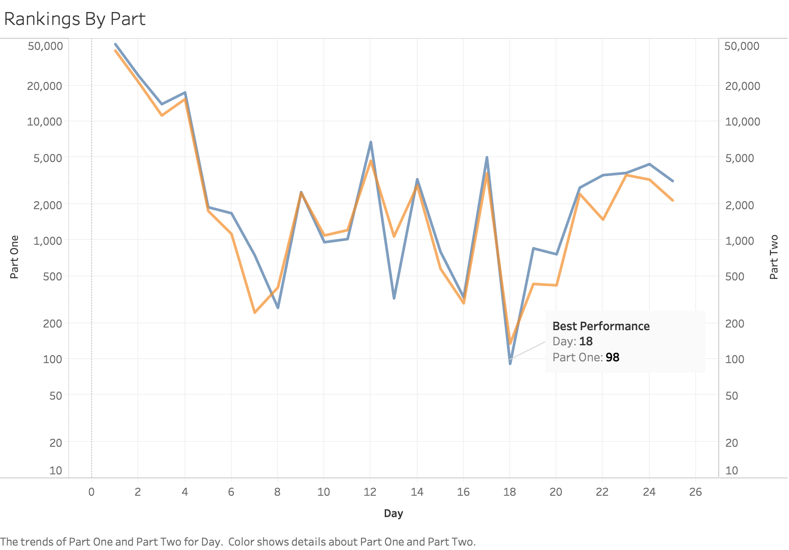

_This blog was written in early January, but I have only just had time to fill in the assets and other_

 

This year, as I was in my last month of my co-op I came across an interesting internet competition in the month of December. The concept of the contest was simple: Every day from the 1st of December to the 25th, a new problem with two parts would be released on the [Advent Of Code website](https://adventofcode.com/2019). These problems were different from the ones that I did on Leetcode, in the sense that they all had a plot around them, and every part could be broken down into much smaller solvable sub-problems that paved the way to the entire solution.

As the month went on, the problems would often build off each other and get more difficult and "tricky" to solve.

This year, the constant theme every alternate day started out with a very basic machine code executor - that they very cutely named `IntCode` since it accepted set of integers as arguments and entire programs were simply larger arrays of numbers.

As the days progressed, the `IntCode` program required more and more additions to it. It started with a very simple addition, multiplication "computer", but then very soon I was adding the features of an "Immediate" argument in instructions and "relative addressing" much like a modern computer. By Day 11, I was required to both give input to the computer as well as take output from it to drive a space robot part of the whole plot.

Having already learnt at school about how the (_very-NOT-modern_) CPU inside the computer worked along with how the instructions were all laid out in memory and how the CPU pipeline fetched one instruction at a times, I had hoped that my knowledge of computer architecture would help me better architect the CPU, but things didn't truly go my way

Some very initial architectural decisions and the incapacity of brain to refactor any of my past code in the wee hours of the night left me with some significant technical debt to inherit.

By Day 11, my debt had peaked so much so that I was up till 2:30AM figuring trying to figure out why my relative addressing was broken and I was manually executing the instructions one by one on post-its and comparing the results.

<table class="hide-on-mobile">
   <thead>
      <tr>
         <th>Debugging a Small IntCode Program</th>
         <th></th>
         <th>Debugging a Large IntCode Program</th>
      </tr>
   </thead>
   <tbody>
      <tr>
         <td></td>
         <td></td>
         <td></td>
      </tr>
   </tbody>
</table>

<table class="hide-on-desktop">
   <thead>
      <tr>
         <th>Comparison</th>
      </tr>
   </thead>
   <tbody>
      <tr>
         <td>
           <figure class="gatsby-resp-image-figure">
              
              <figcaption class="gatsby-resp-image-figcaption">Debugging a Small IntCode Program</figcaption>
           </figure>
         </td>
      </tr>
      <tr>
        <td>
          <figure class="gatsby-resp-image-figure">
             
             <figcaption class="gatsby-resp-image-figcaption">Debugging a Large IntCode Program</figcaption>
          </figure>
        </td>
      </tr>
   </tbody>
</table>

## Interesting Edge Cases with `IntCode`
In the `IntCode` program I ran into very interesting errors during debugging:

1. For some reason I always assumed that the "relative addressing" mode was only for the inputs to an instruction, and forgot the case where we could write the output to a relative address.
2. In some of the `IntCode` instructions the outputs were `1s` and `0s` neatly organized in a 2D array and we were supposed to read the inscription formed by the `1s`. I had added code to convert the array to a black and white image using a Python Library called `Pillow` and at some point due to how my coordinates were set-up in the array it gave me an upside down image of my answer which to my dismay was correct and I spent about an hour trying to debug my perfect computation only to spot the mistake that my array was flipped at the very end of the computation

  |Inverted| |Corrected|
  |:----:|:-:|:----:|
  ||vs||

  The last character in the inverted image surely looked liked an `S` at the time
  
Solving the last problem took forever, since I had to manually iterate through a maze and figure out which items I would need to pick or drop to have the correct weight that would grant me access to Santa's compartment! But it was all worth the effort because I got to see this complete

  
All in all, this year's advent of code was my first one yet, and it sure as hell will not be my last.

I enjoy solving puzzles and Advent of Code definitely scratches that itch!

