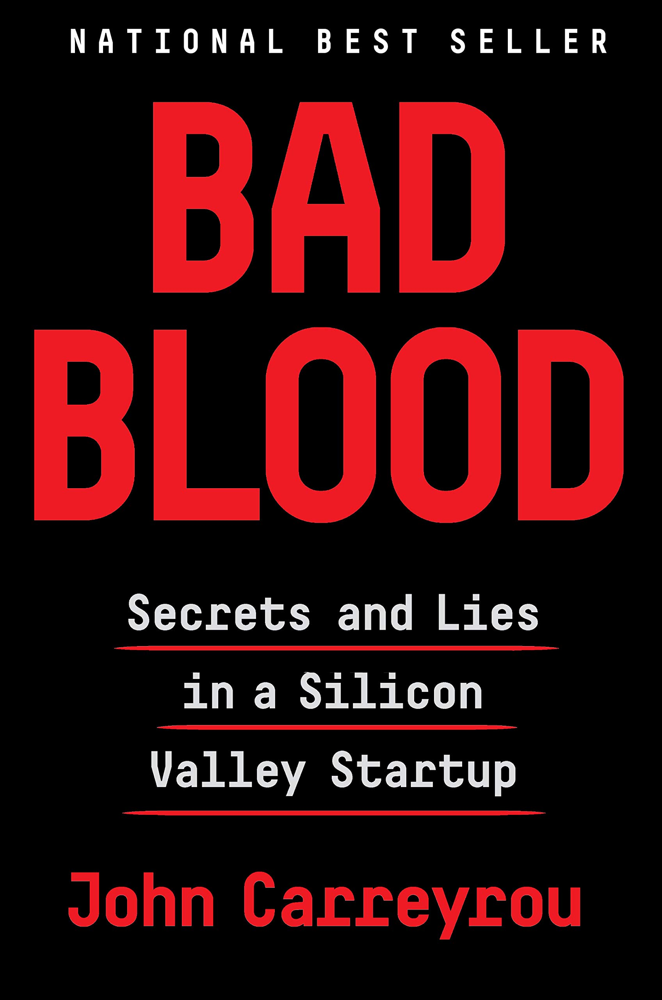

I have not read many books, and out of the handful only a few have managed to keep me reading for 4 days straight.

Written by Wall Street Journalist John Carreyrou, Bad Blood details the meteoric rise and the equally meteoric demise of Theranos, the bio-medical tech firm that promised to revolutionize the blood testing industry forever. If you are not familiar with the story of Theranos, here's the short version: Founded in 2003 by a Stanford dropout when she was just 19, Theranos promised to reduce the volume required for blood tests to just a single drop pricked from the finger. In the years that followed, controlled by founder Elizabeth Holmes, the company went on to become a $10 billion dollar behemoth with partnerships with Walgreens among others. As for Elizabeth herself in 2015, she went on to be featured on the covers of <i>Forbes</i> and <i>Fortune</i> magazine after being named the youngest and wealthiest self-made female billionaire in America.

By 2013, Theranos was valued at $10 billion dollars but their technology never worked, and by the following year news broke out of the same. Elizabeth along with her then boyfriend/business partner Ramesh "Sunny" Balwani are now facing multiple lawsuits in federal court and were indicted in June 2018 for multiple wire-fraud charges even after relinquishing control of the company which was shut down soon after in August.

The investors along with the public had no idea of Theranos' deception until Carreyrou published his investigative report in the Journal. The book offers a remarkable inside look inside the company that was once Silicon Valley's darling but is now as deep sunken as the Titanic.

With a Steve Jobs like "Reality Distortion Field" around her, Elizabeth had the ability to influence and win over people. She was so influential and conniving that she had managed to avoid an ambush by her own board members to fire her by convincing them using the right combination of "contrition and charm" as Carreyrou describes it.

Some of the details in the book are totally insane. During a demo to an investor, Theranos would slow the progress bar on the device to a crawl if the device would encounter an error. During this time, the investor would leave only for an engineer to take out the sample from the device and test in the commercial medical devices available on the market. After a few hours the relevant party would receive the results in the mail to be none the wiser.

Even as plans for Theranos devices to be put into Walgreens stores were taking shape, Elizabeth hid the progress of the project from the people at Walgreens invested in the project. Not only that, Sunny and Elizabeth ran the Theranos ship in tight control, so much so that they did not allow inter-team interactions and even monitored and reprimanded the employees for doing the same. The people at the company joked that the turnover rate was so high that you would never be bored at work.

Kudos to John, who blew the cover on this massive fraud. The bigger question? If someone like Elizabeth Holmes could pull off such an elaborate scheme, one that ultimately put patient’s lives at risk, how do we prevent it in the future? A riveting page-turner, and a must-read for everyone!

The book and the story it described of Silicon Valley made me a wee bit wary of my own prospects there. It raises some serious ethical questions, but it is ultimately a thriller with a tragic ending. It’s a fun read full of bizarre details that will make you gasp out loud. The story almost feels too ridiculous to be real at points (no wonder Hollywood is already planning to turn it into a movie bringing Jennifer Lawrence out of her one year acting hiatus).
