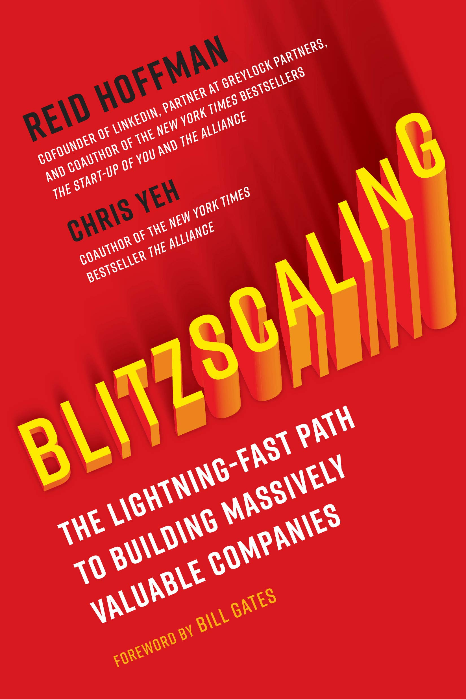

Blitzscaling was written after a Stanford Course taught by the authors by the same name targeted at teaching students about startups, and the scaling that comes with them.
 
For me, having worked in startups, this book provided a truly new way for me to think about companies and how they gain their values. As the authors put it:

> Classic start-up growth prioritizes efficiency in the face of uncertainty. Starting a company is like jumping off a cliff and assembling an airplane on the way down; being resource-efficient lets you "glide" to minimize the rate of descent, giving you the time to learn things about your market, technology, and team before you hit the ground. [...] Classic scale-up growth focuses on growing efficiently once the company has achieved certainty about the environment. [...] This kind of optimization is a good strategy to follow when you’re trying to maximize returns in an established, stable market. Fastscaling means that you’re willing to sacrifice efficiency for the sake of increasing your growth rate. [...] Fastscaling is a good strategy for gaining market share or trying to achieve revenue milestones. Indeed, the financial services industry is often happy to finance fastscaling, whether by buying stocks and bonds or lending money. Analysts and bankers feel confident that they can create elaborate financial models that work out to the penny the likely ROI of a fastscaling investment. **Blitzscaling means that you’re willing to sacrifice efficiency for speed, but without waiting to achieve certainty on whether the sacrifice will pay off. If classic start-up growth is about slowing your rate of descent as you try to assemble your plane, blitzscaling is about assembling that plane faster, then strapping on and igniting a set of jet engines (and possibly their afterburners) while you’re still building the wings.** It’s "do or die," with either success or death occurring in a remarkably short time.

When I was reading this book, I was working as a Software Engineer/Data Scientist at KitchenMate, and I could see so many of these things I read about in play at work. 

Although I did not end up writing a full scale review of this book, here are my selected notes from the same

1. On Silicon Valley glamorisation
> When people think of Silicon Valley, the first things that spring to mind—after the HBO television show, of course—are the names of famous start-ups and their equally glamorized founders: Apple, Google, Facebook; Jobs/Wozniak, Page/Brin, Zuckerberg.

2. How you feel when you are blitzscaling
> Dropbox founder Drew Houston described the feeling produced by this kind of growth when he told me, "It’s like harpooning a whale. The good news is, you’ve harpooned a whale. And the bad news is, you’ve harpooned a whale!"

3. Importance of efficiency when blitzscaling
> If you win, efficiency isn’t that important; if you lose, efficiency is completely irrelevant.

4. On why Uber churns through a billion dollars a year in VC funds
> Companies like Uber subsidize their customers in an attempt to manipulate the demand curve to reach that tipping point faster; the bet is that losing money in the short term may allow you to make money in the long term, once you’re past the tipping point.

5. When are investors up to invest
> Given the desire for home runs like eBay, most venture capitalists filter investment opportunities based on market size. If a company can’t achieve "venture scale" (generally, a market of at least $1 billion in annual sales), then most VCs won’t invest, even if it is a good business. It simply isn’t large enough to help them achieve their goal of returning more than three times their investors’ money.

6. What to do when starting out
> "Do everything by hand until it’s too painful, then automate it."

7. And on the note above, how AirBnb started out w/ photos on its site
> Together, Brian and cofounder Joe Gebbia could photograph about ten homes per day (cofounder Nathan Blecharczyk had to stay at the apartment that doubled as their office, making sure the site didn’t crash). Talk about doing things that don’t scale! Once, a host asked Brian when he’d get paid, and Brian pulled the company checkbook out of his backpack and wrote him a check. "I guess you’re not a very big company," the host said as he pocketed the check. As Airbnb took off, the photography function had to scale up considerably. So the founders hired photographers from Craigslist, hit up their RISD friends, and even recruited Airbnb hosts who listed photography as a hobby. By tapping these sources, the company was able to build a stable of five to ten photographers who were paid $50 per home, and whom they tracked using the sophisticated management tool of a spreadsheet with photographers and their assignments. Pretty soon, this system too was overwhelmed. So they hired Ellie Thiele as a summer intern from Syracuse University, and made managing photographers her full-time job. By focusing solely on managing the photography, Ellie was able to increase the number of active photographers to about fifty. It was only at this point that Airbnb went to a truly scalable solution: software. Nathan wrote some code, adding two buttons to the site; one for hosts to request a photographer and the other for Ellie to trigger a payment when a photographer

7. On Amazon
> "I sometimes wonder if Amazon’s owned-inventory business is just a marketing loss leader and a capital-intensive competitive moat."

8. How Twitter reached its MAU/DAU targets 
> Data is the lifeblood of decision making for any company, but it is particularly fundamental if it informs the design of your product, or if acquisition marketing is your key distribution strategy. For example, when he was at Twitter, my Greylock colleague Josh Elman needed to figure out how to keep Twitter users actively using the service. By analyzing the data, he was able to determine that the "core users" who were 90 percent likely to be active month after month were using Twitter on at least seven different days per month. Further analysis showed that what set these users apart from the less active users was that they followed over thirty other Twitter users. Once Elman understood these figures, Twitter was able to encourage new users to follow more accounts, and, within sixty days, Twitter was able to get its ratio of daily active users to monthly active users above its 50 percent target.

9. Platform economies
> There are over 2,800 apps on the Salesforce AppExchange, and an International Data Corporation (IDC) study showed that the Salesforce ecosystem generates 2.8 times the revenues of Salesforce.com itself. That means that while Salesforce.com has revenues of "only" $8.4 billion, its platform gives it the economic impact of a $32 billion company.

10. On China being the land of blitzscaling
> China also has major advantages when it comes to overcoming the growth limitations of operational scalability, thanks to its flexible labor market, which was explored in a 2012 New York Times article about Apple’s manufacturing operations in China: "Apple’s executives had estimated that about 8,700 industrial engineers were needed to oversee and guide the 200,000 assembly-line workers eventually involved in manufacturing iPhones. The company’s analysts had forecast it would take as long as nine months to find that many qualified engineers in the United States. In China, it took 15 days."

11. On why concentration of wealth in a few companies can also be benficial
> Even the concentration of capital that scale has produced isn’t all bad; it has allowed blitzscalers to tackle "moonshots" like space travel (SpaceX) and autonomous vehicles (Google’s Waymo) that may dramatically improve our lives.
