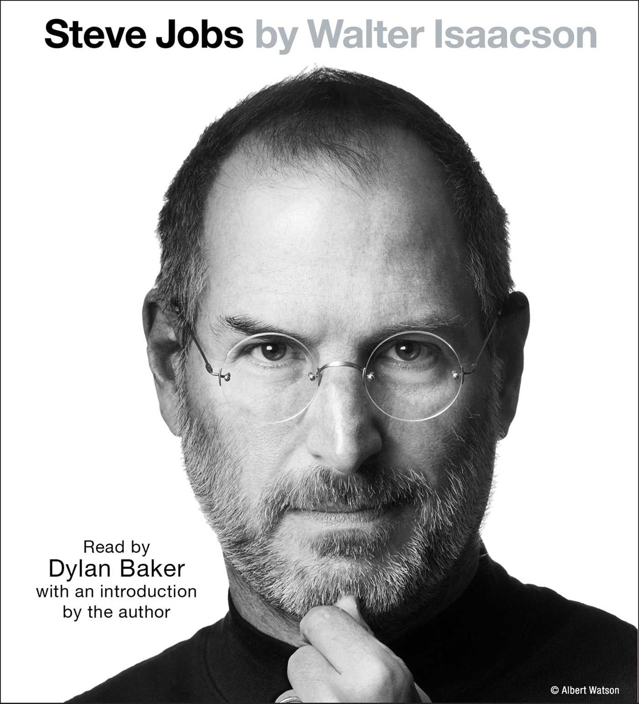

Its been almost 9 years since this book about Steve Jobs was published, but I just really never got around to reading it, despite having picked up the book on multiple occasions to read the first chapter numerous number of times. The story of this crazy hippie from California that went on to start the world's most valuable company right now is one of the most renowned rags to riches story. My personal relationship with Jobs is parallel to someone worshipping a deity,s evidenced by the fact that I went on a fruitarian diet on his first death anniversary.

Walter Isaacson leaves no stone unturned in this rollercoaster of a life that Steve Jobs truly lived. The book itself seems like a product of Steve Jobs as evidenced by the story that Jobs spent quite a while convincing Isaacson to be the one to write his biography having seen Isaacson write the same for Albert Einstein and Benjamin Franklin, who Steve very strongly paralled himself to the greatness of.

The book is littered with tiny tidbits of great intuition of what customers want through the eyes of Jobs, even before customers knew they wanted them. Simple example of that is the calculator story that Walter recreates, where Jobs would hound the designed of the Mac's original calculator app repeatedly on minor adjustments all the time. Eventually that designer gave up, and built a tool that would allow Steve to fiddle with the design himself until it was perfect, which Steve did and after that, the same calculator was shipped on all Macs for the next decade.

Jobs masterful negotiation tactics when dealing with team members and having his "reality distortion field" making you feel like nothing was impossible, it is no doubt that the products Apple made in that era contributed significantly to what it has become now. And it wasn't just Apple that Jobs contributed to. His contributions to animation graphics through Pixar's original films with Disney is a major feat of achievement for the film industry having spun off a multiple series of stories from Toy Story to The Lion King. Even at Apple he pioneered multiple lines of products starting with the personal computing section and Macs, and then going all the from the iPod to the iPod Touch to the iPhone and lastly to the iPad all of which have generated billions of dollars in revenue for the company.

This book is not hearts and roses though. It also paints a more personal side of Steve, one that is littered with his tumultous relationship with his birth family, his own daughter, as well as the team at Apple. Jobs’s managerial style (or lack of one), had been previously well-documented after his ouster from Apple, but the biography is probably at its harshest when describing his various working relationships with other people. We are presented with personal accounts of a well-known volatility that is increasingly shocking, sometimes delusional, and always, in the mind of its subject, justified. One of the true revelations of the book is that Steve Jobs cried — a lot, and in the presence of his co-workers. From the earliest days of his career when he cried to Steve Wozniak’s father Jerry about getting Woz to come work at Apple full time, he broke down in tears regularly when frustrated, when cornered, when happy or touched, and when angry. Though his return to Apple did seem to bring some temperance and evenness to his management efforts, Jobs never stopped openly crying when emotion overwhelmed him.

The book also rallies a part of the story with Jony Ive, long term confidant and deisgner in partner to all of Apple's great products under Steve, and the book also highlights their struggles in a post-Steve Apple. For nearly the entire latter half of the book, and much of Jobs’s "phase two" at Apple, his health was a near constant concern for those closest to him, and Ive was in that inner-circle. When Jobs returned from a two-month stay in Memphis in May 2009 following his liver transplant, Ive and Cook were there to meet him and his wife on the tarmac. Both Ive and Jobs reported feeling the same way — Ive was "devastated" and "underappreciated" by media stories questioning the ability of Apple to innovate without Jobs, while Jobs was somewhat miffed at Cook’s earnings report call where he suggested that Apple could do just that. "He didn’t know whether to be proud or hurt that it might be true," Issacson writes.

In that respect, Jobs the man is consistent throughout, expressing little regret or dissatisfaction with himself, except for his repeated wish that he had spent more time with his children, who, he says, were his main motivation for cooperating with and encouraging that a biography be written at all. In a world where people and media will pay actual money for one glimpse of a dying and frail CEO, Steve Jobs will not be the final book on the man, but it will be the only one told largely in his words, and the only one in which he had the final say on its cover.
