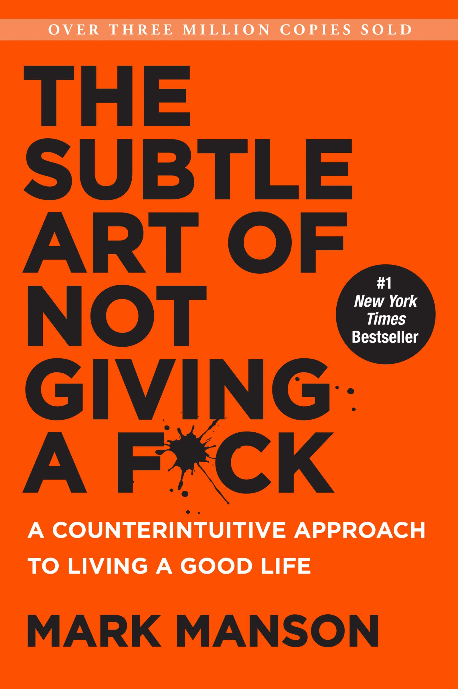

> The more something threatens your identity, the more you will avoid it.

Written by Mark Manson, this self-help book actually paints a subtly different story than one would expect from the title.

Mark Manson draws from his life experiences to highlight the fact that we should care a little less about the small things but give it our all to things that really matter. The life-blogger truly dissects the entire positivity conundrum to teach us the fact that it is okay to sometimes not be okay. He drives the point home that if you’re worrying too much about small things in life that you don’t really have too much going on in your own life.

Manson makes up a law called the Manson’s Law of Avoidance that states the simple fact that the more something threatens your identity, the more you will avoid it. This simple fact makes sense on reading, but actually thinking about it retroactively makes so much sense and truly was the highlight from this book for me. Moreover, his words on choosing a broader identity rather than a narrower one truly resonated with me.

Manson’s replacement of the Inspiration →  Motivation → Desirable Action loop with Desirable Action → Inspiration → Motivation → Desirable Action also put the point forward that one must do something before seeing the smallest of results which will in turn drive inspiration and motivation. This simple fact of simply starting something off and then gaining inspirations from the results to continue and finish the task truly drive home the point that he borrows from Tim Ferriss of actually doing something first.

Personally, I liked the part where he asks the reader to assume that everything that has happened to them is a result of their own actions and doings directly. It put some things in perspective for me that sometimes I may not always been the victim of the circumstance and there were ways for me to avoid getting into such situation or even if I did, at least learn to spot them earlier and act on them.
Another part I liked about the book, is the part where he describes absolute freedom to be utterly meaningless, since I have personally seen myself fill up time with useless unproductive tasks whenever I had the time and the freedom. The following quote put some things in sense for me in the longer run, and I will definitely try to keep in mind as I go.

> Ultimately, the only way to achieve meaning and a sense of importance in one’s life is through a rejection of alternatives, a narrowing of freedom

Overall this humor packed, occasionally sarcastic 50 thousand page word book was worth the read and if I’m going to be completely honest I extremely liked certain parts of the book while other parts of the book were just there for me, or maybe a little irrelevant at this stage in life for me.
