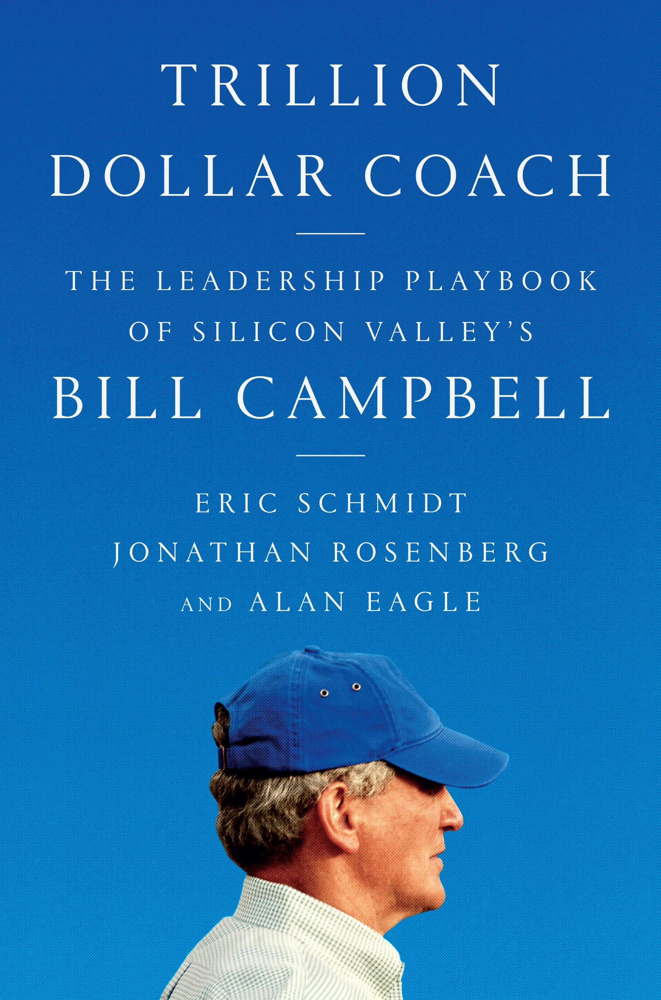

As an individual in the tech industry, the story of Bill Campbell, Silicon Valley's Coach is really one that I should have heard of a long time ago. The sheer fact that I did not, really goes to show that Coach didn't like to be in the public limelight.

The book shines a light on how one man and his teachings were behind the successes of so many tech CEO's and teams in Silicon Valley. The title is apt in the fact that the people he helped included Steve Jobs, Eric Schmidt, Larry Page, Sergey Brin that among just people from 2 companies (Apple and Google) the valuation exceeds a trillion dollars.

The book narrates the story of how this football coach turned tech coach influenced the career paths of so many. Although he was a great football coach, he was often looked down upon for caring about his athlete's overall performance in school as well as their athletics but he was able to use apply this holistic approach of training to mentoring tech leaders in their conquests.

The book offers troves of advice on how to mentor people on your teams, foster their growth all while establishing trusting relationships. Bill Campbell was able to apply his techniques on such a large scale and in such an effective manner that the legacy he left behind still carries weight among the Silicon Valley elites that came together to write this book.

I found this book to be very helpful if I were to ever find myself in the position of mentoring someone else. 

Here are some selected quotes that I loved from the book:

1. On the people who showed up to Bill's memorial
> So there was no way Bruno _[Bill's regular caddie]_ was going to miss Bill's memorial. When he arrived at Sacred Heart that afternoon, he was ushered toward the front, close to Bill's family. "I was sitting right behind Mr. Cook and Eddy Cue, from Apple," he says. "And right next to a guy, I forget his name. I think he runs Google.

2. On profanity in the workplace
> Bill was a delightfully profane man. He used the F-word the way people today uselike, almost as if it's a new part of speech, not verb, adverb, adjective, pronoun, or noun, but a word of its own category. Jonathan once sent Bill a study he had found showing that swearing in the workplace enhances morale. Bill's uncharacteristically understated response: "A good one for me!" 

3. On leadership
> "your title makes you a manager; your people make you a leader."

  > Trust means freeing people to do their jobs and to make decisions. It means knowing people want to do well and believing that they will.

  > **LEAD BASED ON FIRST PRINCIPLES**:  DEFINE THE "FIRST PRINCIPLES" FOR THE SITUATION, THE IMMUTABLE TRUTHS THAT ARE THE FOUNDATION FOR THE COMPANY OR PRODUCT, AND HELP GUIDE THE DECISION FROM THOSE PRINCIPLES.

  > **MANAGE THE ABERRANT GENIUS ABERRANT**: GENIUSES—HIGH-PERFORMING BUT DIFFICULT TEAM MEMBERS—SHOULD BE TOLERATED AND EVEN PROTECTED, AS LONG AS THEIR BEHAVIOR ISN'T UNETHICAL OR ABUSIVE AND THEIR VALUE OUTWEIGHS THE TOLL THEIR BEHAVIOR TAKES ON MANAGEMENT, COLLEAGUES, AND TEAMS.

4. On managing a board of directors
> Patrick Pichette: "Bill saw all the chess pieces all the time, because he had the luxury of not being on the board."

5. TOP "BILLISMS"
  > Bill often had a unique way of telling you that he loved you. These are his top ten favorites, as recalled by his Columbia friend and teammate Ted Gregory. **They were printed on the back page of the program given to guests at Bill's memorial service.**
  > > 1. "That's the sound of your head coming out of your ass."
  > > 2. "Don't fuck it up." 
  > > 3. "You're so fucked up you make me look good." 
  

6. On High performers 
> In fact, it is often the highest-performing people who feel the most alone. They usually have more interdependent relationships but feel more independent and separate from others

7. On coaching the top
> "I don't take cash, I don't take stock, and I don't take shit."
    