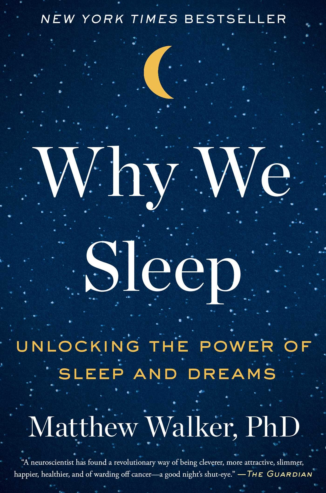

No other book has had a more profound effect on my life than this book by Dr. Matthew Walker. The book has highlighted to me the profound culture that we have that portrays the story of "sleep is for the weak", when indeed "sleep is for the smart".

I will admit that I started reading this book sometime early this year, and only just got around to finishing it, but during those months, I found myself prescribing myself a healthy night's of rest, and making better life decisions to support a better sleeping regimen. That included cutting off most of my caffeine consumption, setting up a sleep schedule that sometimes was excruciatingly interfering with my late night parties at University. It also involved getting up at the same time everyday, or at least trying to continue the habit into the weekends after managing to keep it up during the week itself. Reading this book also took longer since I found myself to be taking his advice of not reading late at night and instead going to sleep on time as I should.

Dr. Walker truly managed to change my relationship with coffee and caffeine once I learnt that caffeine had a half life of about 5-6 hours in the body, and that was the number cause that people couldn't relate their morning coffee to a bad night of sleep the same day. Learning about all the sleep studies, the cycles of REM and NREM in sleep truly gave me a new appreciation of how so many biological processes were linked to a good night's sleep.

Even the sheer fact that schools that started at the crack of dawn were not right for children who had different sleep schedules compared to their adult counterparts, often actually getting in sync with their sleep cycles right before their early morning alarms went off. It made me reflect back to some of my own days when I went to evening school for a year, and thinking back it was probably the most relaxed school year (looking at it albeit with some reminiscing goggles now) waking up at 9am for school that went on from noon to six in the evening. The same so-called 9-5 has also been propagated in the workplace, despite it hampering the health of all those whose sleep schedules do not align. Dr. Walker recommends setting up flexible work hours that involve 3 core hours of noon to three where everyone is expected to be working to allow the lark to start work at the crack of dawn, while the night owl can peacefully get their sleep as well without cutting down on working hours.

The biggest travesty of all is the fact that we have all succumbed to the brightness past sunset in the form of indoor lighting everywhere, our devices flushing our eyes out with crazy amount of blue light that disrupt our sleep patterns by inhibiting the production of melatonin i.e. the sleep inducing hormone.

So, a few questions that everyone has when they want to know the gist of this book.

1. **Does everyone need about 7-8 hours of sleep? **
Ans: Yes, probably even more if you're a young child, or an elderly person, even if you have convinced yourself of otherwise. The sheer performance drop of one night's disturbed sleep should be enough proof for anyone who is trying to "be more productive" by cutting sleep short.

2. **Why _do_ we sleep?** 
Ans: All living organisms sleep, all of them need to relax, rejuvenate and process their days while asleep. Sleep essentially bathes the body in a complex neurochemical bath that improves our brain in various ways i.e it restocks the armory of our immune system, helping fight malignancy, preventing infection, and warding off all manners of sickness, not to mention the memory strengthening benefits. All of these greatly enhance the quality of our life, just in ways that we can't always see as clearly.

3. **What can I do now to improve my sleep hygeine?** 
    - Replace LEDs with traditional brighness controllable lights that do not bathe your body in a permanence of light
    - Reduce blue light consumption through your electronic devices by making your bedroom a safe space against all such electonic devices that hamper with your sleep.
    - Get into the habit of not waking up with alarms. Imagine being in a pseudo-comatose state to be awoken by the sounds of a blaring alarm in your ears, that act itself does more damage to our bodies in the form of increased stress, pressure on the heart than we could ever imagine. _And_ if you do need to set up an alarm, never snooze, once is bad enough. In our current environment amid the pandemic we can very easily have flexible schedules that accommodate this routine, so it is a surprise that people are still sticking to schedules that harm their own health.
