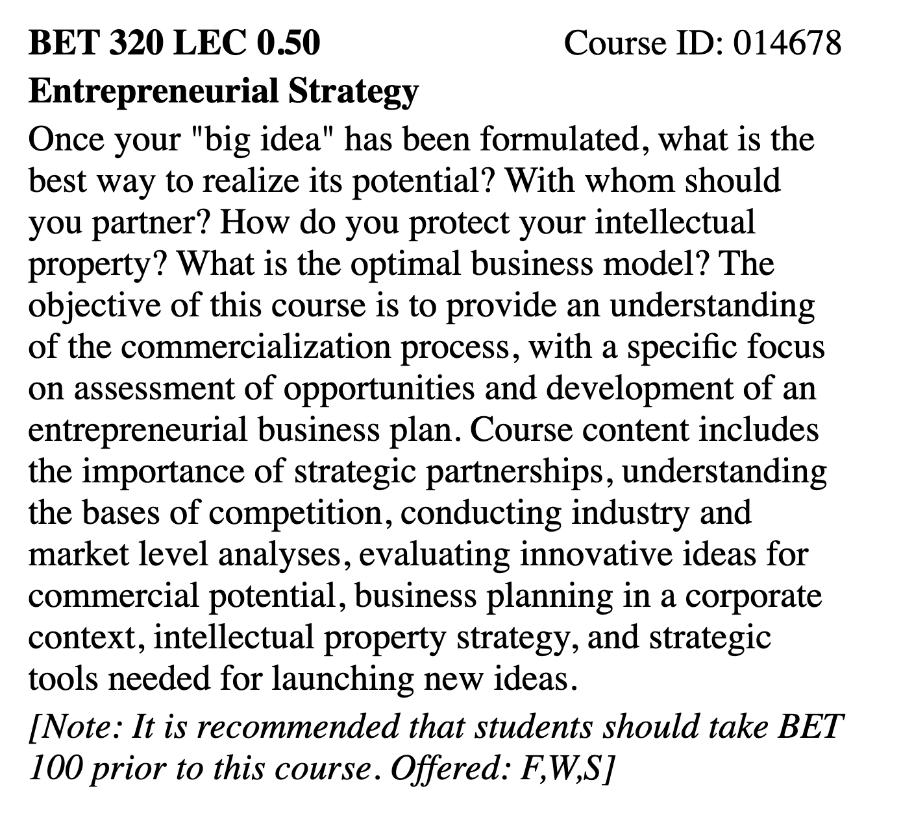
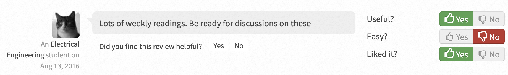
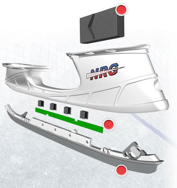
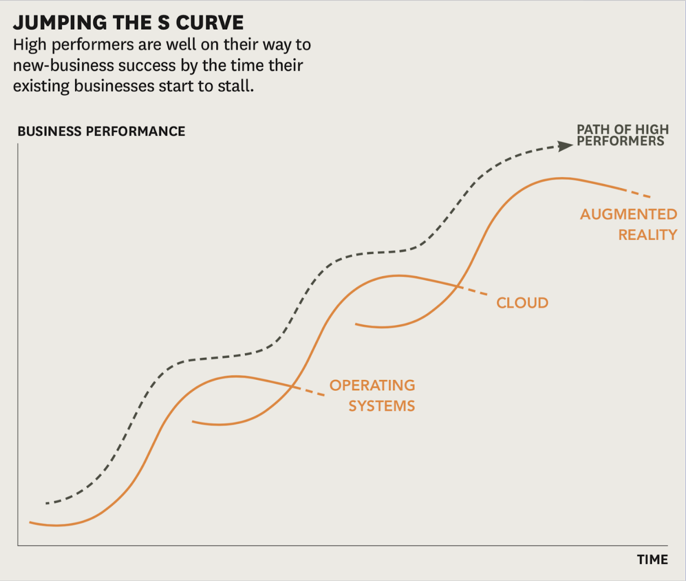

 

Over the past summer, I had the opportunity to take my first elective as part of my undergraduate degree. 
After some discussion and debate I ended up taking BET320: Entrepreneurial Strategy, and I really really liked the course.

 

Often one gets stuck in the rut of ECE courses, and forgets that there is more to university other than struggling with circuits. BET320 was almost the first course in university that forced me to think differently, and out of the box. 

Taught to us, by Prof. David Rose, the course definitely opened up my horizons on thinking about the companies, their business models and the constant need to catch the next wave of tech (or as the course put it - the next S-curve - based on a [Harvard Business Review (HBR) Article](https://hbr.org/2011/01/reinvent-your-business-before-its-too-late)). The course in itself was graded and divided into 4 parts - class participation, one individual case assignment, one timed "midterm" case assignment and one "final" group class case presentation each worth 25% of the course.

Over the course of the term, we were expected to do weekly readings of multiple HBR articles, or listen to hour long talks by popular management scientists on YouTube. Having done that work, we were then expected to engage in class discussions about the same, and how we evaluated those articles, and what we learnt from them, with very obvious guidance from Prof. Rose.

Within 3 weeks of our first class, we were expected to do an analysis on our own based on one of the cases written by Prof. Rose on the demise of a company called "ThermaBlade" that aimed to revolutionize the sport of ice hockey by using heated blades.

 

I had to take the assistance of a few of my friends to be able to come up with literally anything of value, only to meet the professor on the day of the submission to realize that pretty much that I had written was independent of the course concepts, and needed more substance in the form of correlation with business concepts taught in the course. This was definitely a first for me, given the fact that most courses in engineering are fairly straight-forward and have a very clear yes-or-no correct-or-incorrect answer. My case had been built upon how the technology was not something innovative, but rather a combination of existing tech, but after meeting David, I had to change the case to show how the tech was leading in an industry where there was absolutely no need of the market since the game was already extremely quick and fast-paced.

As for class participation, it became more and more difficult to keep up with the readings during the term, especially with the peak periods of assignments, labs and other shenanigans that ECE kept me occupied with. All during this, there were some weeks where I did manage to do all the readings but the core of the material was not lost on me during class discussion, which definitely helped.

In a group of 4, we based our case on Microsoft and its constant evolution in the tech industry, starting out from the operating system era and then moving on to cloud, while still keeping its hardware business intact albeit in rough waters.

 

Overall, I would without doubt recommend this course to anyone that wants to learn about how to keep a business alive, and define the culture of constant innovation, while being able to balance all the [forces](https://hbr.org/2008/01/the-five-competitive-forces-that-shape-strategy) in the industry and [crossing the chasm beyond the early adopters](https://www.youtube.com/watch?v=6LHnFsqpzMM)

