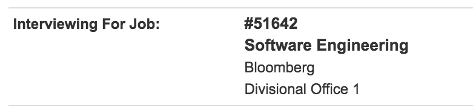

## Prelude
The University of Waterloo has in almost all programs a system where every student has to pursue a co-op job almost every alternate 4 months. This means that every term the student is either studying and looking for a job or actually on a job. This has been a major attraction for students like me to come to the university.

But with the pros of such a system also come the cons since the students also have the added pressure of finding a co-op job as soon as possible so that they can get back to their studying.

Going into university I knew the fact that I lacked any real marketable skills to land any of the internships. My resume was empty, I didn't have a website, I didn't even know what Github was, which all clearly implied that I had work to do.

## Steps I took for Skill Development

1. Joined student design teams since this was the easiest way for me to justify my time and the impact I was making. This has had the highest return on investment.
2. Got my resume critiqued from everyone I knew, this included the university's services, seniors and sometimes even people I met randomly who I felt were in a position to give me some solid feedback on my resume.
3. Worked hard on my side projects where I ensured that I was getting some work done that would allow me to have a better chance at getting an interview. This also implied going to a few hackathons since that is a great platform for me to get a jumpstart on a project in a team of 4 other developers.

## Applying to Jobs

Any student in his or her first year given the opportunity to apply to Google, Facebook, Microsoft and all the other big name etc VS a small company that they haven't even heard of, would any day chose the larger company even if it meant that they wouldn't even get an interview. It's basically the Fear of Missing Out aka FOMO so that one doesn't wish that they lost out to an opportunity where they could have gotten an interview!

This was the dilemma I was in, do I risk applying to higher quality jobs even if it meant that I would get no interviews? or do I am aim low and get interviews?

I took the first approach and applied to companies that I had heard of or had been recommended about. When I emailed an initial shortlist to one of my upper year friends his reply said and I quote:
>  Your list is very optimistic to put it bluntly.

I updated my list to include some of the banks that I had heard of in Canada, got a friend of mine to refer me in Canada's top bank and shortlisted about 80-90 jobs out of the available almost 800 jobs. The excruciatingly time consuming task of shortlisting 50 jobs from the remaining 80 came down to me, sitting down on my laptop opening a spreadsheet, reading the job description, reading about the company and then making the final call. When the time came to apply, I just clicked apply one by one on all my jobs and was done in about 2 hours.

## Interviews

When the time came around for interviews to show up, I waited and waited and waited for a few weeks as all my classmates got interviews hoping that I would get at least one. Until one day, without any expectations, I see this:

What?? I got an interview from Bloomberg while all those smaller companies just rejected me? It seemed some mistake had happened but it was true. Over the next weekend I spend day and night on leetcode and did every "Bloomberg" question that I could find. When the time came around to the actual interview, I nailed it! and answered all the 3 questions that they asked although not to the completeness that I would have liked but to the completeness that was acceptable. Sadly I didn't move into their second round but got an encouraging response from my interviewer:

> Hi Aditya - It was a very competitive first round.  Unfortunately you didn't make it to the second round but I encourage you to apply again as you were very close to making it to the second round.
>
> Thanks,
>
> Adam

Then as main round was wrapping up and I thought I was going to have to go into continuous, I get 2 interviews back to back. I did both of them but since none of them were technical I nailed them both and in one of the interviews the employer basically told me that I got the job and was asking whether I wanted to take it. At that point not knowing yet the result of my other interview I was like sure I'll take it since it's the best that I had at that point in time.

I also got an another phone interview from RBC a day before main round was supposed to close in which they asked me machine learning questions in my interview. It was a super high level interview and I was a little taken aback but I answered all of the questions that they had.

## Result Day

When it's time for decisions to roll around, I get 3 offers... All the three employers except Bloomberg (who I already knew gave up on me) wanted me to take the job position.

## Making my Decision

Three Job Offers was sort of unheard for international co-op students who had no experience coming in and I was surprised that I was able to do that myself.

The decision of choosing which one was even harder. Taking the opinions of over 6 seniors, my parents, my professor at university over 4 days and even contacting the employers by email to get a better feel of the respective roles. It was a journey with ups and downs.

It's been one of the biggest decision of my life, but I am happy to say that I am going to be working as a Full Stack Developer at [LCBO](https://www.linkedin.com/company/lcbonext/about/) this summer and hope to learn a lot!
