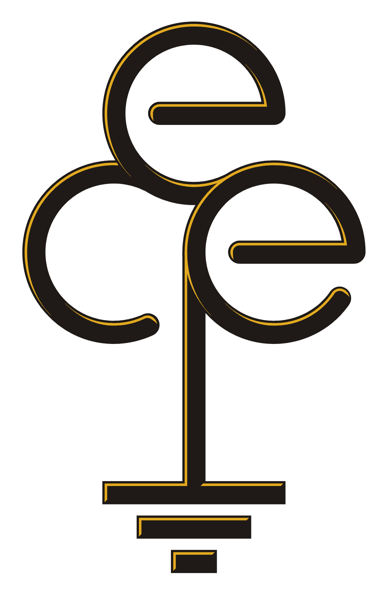

Having done almost half my degree feels extremely good. It feels like the hump of effort is well behind me and that smooth sailing is ahead [I can already see myself eating my words once I start 3rd year]

The program up until now has been a mix of some really great professors, some great courses, and equally bad professors and courses.

Lets go over the good:

1. **ECE205 - Differential Equations**: Prof. Conrad Hewitt, in my honest (and rather unpopular) opinion, has been one of the best calculus professors I've ever had. Never having uploaded a single lecture online, his lectures have been the most engaging. My friends in the Computer Science program, will tell you other things about how his teaching is not necessarily the best, but for me, Conrad was everything I look for in a lecturer: clear, engaging and responsive to questions.

2. **ECE224 - Embedded Microprocessor Systems**; Prof. Bill Bishop, ties for first with Prof. Conrad Hewitt despite my inability to always understand everything in class due to the sheer amount of office hours the professor was willing to put out to truly be able help us understand the material.

Honorable mentions for the _good_ goes to my Business Elective this term, Entrepreneurial Strategy [BET320 with Prof. David Rose for those interested]a. The course really taught me that a good company is more than just a great idea or product, and has many many more dimensions

Moving on to the irrelevant/meh courses:

1. **ECE204 - Numerical Methods**: This course was about how computers can estimate solutions to mathematical problems, such as differential equations and linear equation to get answers close enough to the actual answer. Taught by Prof. Douglas Harder, this course was essentially free marks if you read the notes, and prepared a real thick cheat notebook for the final, rendering the final essentially open book. Moreover, I don't see myself using any of the estimation techniques in real life or even in future courses.

2.  **ECE108 - Discrete Mathematics**: Being my first proofs course at the university, I had certain expectations on how and what the material was going to be taught. Over the term Prof. Paul Ward taught us about just some proof systems, Kalish Montegue and Semantic Tableaux but still managed to make a 350 mark final. Despite also being a relatively free course in terms of the grading, I sadly do not see myself using any of this in outside of school or even in future courses.

<!-- The University formalised a newer curriculum for ECE starting in 2017, and introduced a fair amount of new courses, that sadly have had not enough time for the material to be polished. -->
Moving on to the bad:

1. **ECE240 - Electronic Circuits I**: This course taught by Prof. Lan Wei was the absolute worst. Any student in ECE dreads the course, and circuits after the course, just due to the sheer difficulty and expanse of the course starting from basic capacitor circuits through Operational Amplifiers, ending at Transistors. I am no newbie to pressure, but this course officially made me have a mental breakdown one day before the final and I physically could not study. The material is irrelevant at the level of abstraction it is taught at for Computer Engineers, and frankly should be removed from the curriculum for the same and alternatively be offered as a technical elective for those interested.

2. **ECE298 - Instrumentation and Prototyping Laboratory**: This quarter credit course, is 100% not worth the time investment that it requires. There was a _very_ clear difference in the amount of experience the course designers expected ECE students in 2B to have as opposed the experience that students actually had. The sheer lack of support for the students further exasperated those who wanted to do really well in the course.

Overall, I would say that first year was extremely chill in terms of the material that was being taught, and I _could_ skip a lot of the lectures and get away with it. As the years progress, the material is becoming more advanced, and lectures become mandatory, but with that the material is also getting increasingly more interesting and relevant to what I do on my internships and outside of school.

Although it might seem so, everything is not as green as it looks. University of Waterloo, does feel like an endlessly churning cycle of school and work that overworks the student to the bone, and it is not uncommon to not be able to devote any time to time for one's own mental health. Despite graduating with 2 years of experience, I would honestly _love_ to slow things down, even if by a fraction, so that I have some time to take care of myself mentally and emotionally, maybe cook some more, and just sit in the sun and relax. It gets extremely draining to be able to perform at the level for such an extended period, and it is absolutely no surprise that about one-third of the class I started with isn't here with me anymore.

This isn't meant to be a warning to incoming students, but rather to pass on a lesson that I have come to learn too late:
> Sometimes it is 100% absolutely fine to give up on an assignment or lab or course to preserve some sanity and clarity of what end goal one wants to achieve
