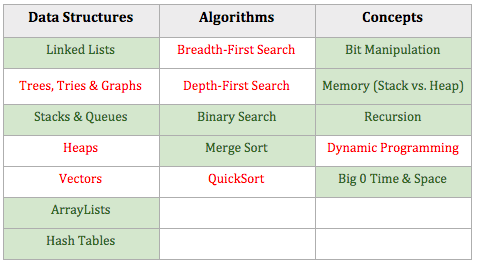

_A version of this article appears on Pramp's Medium Blog [here](https://blog.pramp.com/how-i-failed-my-interview-at-bloomberg-but-ended-up-with-three-other-offers-d9352e230f53)_

Landing an interview is no easy task, but once you’ve cleared that hurdle, the process gets easier. Succeeding in the interview, however, is an entirely different story.

This is the story about how I prepared for my first technical interview as part of the co-op program at the University of Waterloo.

## The Beginning

It had been two weeks after submitting about 50 applications through my university’s co-op. Some of my classmates were starting to get interviews while all I received were 4 rejections. I would see people leaving classes in their three-piece suits to attend their interviews, and, although I was worried about not finding an internship at all, I was starting to worry that I hadn’t heard back from many positions. I figured there was something I could do better, but I was wasn’t sure what it was.

Then one typical Thursday, an email popped up in my inbox with the subject, ‘Congratulations! You’ve been selected for an interview.’ I quickly opened my university’s job portal to be overjoyed at the news that I had gotten an interview for the one and only Bloomberg! They were hiring for the role of ‘Software Developer’ at their head office in New York. Ecstatic at this news, I realized that I now had to prepare for my first technical interview.

## A little background on my CS knowledge

Before this interview with Bloomberg, I knew that technical interviews focused on Data Structures and Algorithms over everything else. I had also done about a hundred problems on Leetcode out of which about 80 were easy, and 20 were a mix of hard and medium difficulty, according to Leetcode.

Having browsed [r/cscareerquestions](https://reddit.com/r/cscareerquestions) for a while by then, I knew that [“Introduction to Algorithms” (CLRS)](https://www.amazon.com/Introduction-Algorithms-3rd-MIT-Press/dp/0262033844) and [“Cracking the Coding Interview” (CTCI)](https://www.amazon.com/Cracking-Coding-Interview-Programming-Questions/dp/098478280X) was going to be the books that I referred to the most.

Side Note: I had read CLRS’s first chapter before getting my first interview but decided against using it to prepare. I only had a short amount of time before my interview at Bloomberg, and in my opinion, the book had too much pseudocode. I was used to seeing code syntactically written. I knew all of the topics shown below in Green to some extent but was mostly using a key from my Leetcode solutions. [The list is sourced from CTCI]

## Actually Preparing for the interview

I borrowed Cracking the Coding Interview from a friend of mine to see what the hype was all about. I soon discovered that the hype was well deserved! Reading the first few chapters gave me so much insight that I even made my own cheat sheet. This allowed me to get the ball rolling on the general questions before the technical part of the interview. Here’s a sample:

**Characteristics of coding interviews over HR interviews at Tech Companies:**

1. The only interviews where the questions are not entirely based on your resume
2. The only interviews where they test you on the skills that you have gained in the past

**Specific characteristics of coding interviews for internship roles:**

1. Not expected to be a god at programming, expected to make mistakes along the way but using them to build expertise
2. Technical questions in the interview weren’t expected to be solved by using tricks but rather their purpose was for the interviewers to judge your problem solving abilities. They want to see that you’re able to break a problem down into smaller more solvable components until you finally arrive at a solution that becomes easy to code and test.

## My real preparation

I read the chapters from Cracking the Coding Interview one by one, skipped over few of the topics I knew until I was about 60% done with the book. I’ll spare you the summary of the entire book, but I learned a few key things specific to technical interviews:

### Technical questions
- **Imperfections are acceptable**: Your solution to the problem does not have to be the best possible solution, both you and the interviewer are aware of the time constraints, so always put up a solution first, and then refine it. This also means that missing semicolons is not a big deal.
- **Test your code**: Always test your code, when you write the code on paper you tend to miss some glaring bugs that would otherwise show up in a simple compile.
- **Practice writing code on paper**: Typing is easy, writing is hard, especially since it feels foreign to write code on a piece of paper or whiteboard at first. When you write on paper, you’ll realise that you can’t insert lines by pressing the ‘Enter’ key; you have to space your code appropriately to allow for changes in real time!

### Behavioral questions
- **Be specific, not arrogant**: let the interviewer derive the interpretation, describe the parts that you thought were challenging
- **Limit details**: Describe a generalized summary of what you did and say that you “can go into more detail if you’d like” if the interviewer appears to want more information.
- **Focus on yourself, not your team**: Assume that every question is about your role and speak to that.
- **Give structured answers**: Nugget first (quick summary of what you are going to describe), S.A.R. (Situation, Action, Result). The Action is the meat of this answer, do not just gloss over it.

Having read about most of the topics in the book [I did not try to solve many problems from CTCI since I was already comfortable with Leetcode], I switched to Leetcode where I started using my newfound knowledge of Binary Trees, Depth First Search and Breadth First Search to quickly code up some solutions to the easy problems. I slowly upped my level to the medium questions and then spent my brain-power on the mind-numbingly hard problems.

One key thing which I feel worked out for me was that I didn’t spend too much time on a specific problem, considering the fact I only had 2 days left to prepare. Instead, I read up on the solutions and the explanations behind them from the discussion panel and then moved on to the next problem only to return to the same problem later and do it myself. More often than not, I remembered the trick and sometimes even applied it to other questions.

I also asked one of my seniors for advice, who was then working at Bloomberg in the same role, and he echoed the points that I had written above which helped boost my confidence in my abilities.

Then, over the weekend before the interview, I coded the solutions to about 150 problems ranging from Two Pointers in Linked List to more common questions like 2Sum and 3Sum. These problems were more or less coded by hand on paper and refined on my laptop to pass all the Leetcode test cases, but since I knew that they weren’t looking for perfection, I knew I was going in the right direction. I even did some mock interviews by timing myself when solving problems to ensure that I never lost track of time.

Going into the interview, I had a [cheat sheet](https://docs.google.com/spreadsheets/d/1zegoYyakTX68WK71UbNjkes08VsaQfVNqvcCSpziS0g/edit?usp=sharing) ready with answers to the most common interview behavioral questions, and some further details about my previous experiences and projects. When the actual interview time came, I was able to answer all the questions they asked me. Not to the completeness I would have liked, but to an extent that was acceptable. The behavioral questions were as expected, but since I had my cheat sheet handy, I was able to give answers that were more concise. As for the technical part, I stumbled a little bit on the first technical question, but soon found my rhythm and answered the other two in quick succession.

Although I did not end up getting the job from Bloomberg, I did learn a lot in that one weekend, and it has paid out its dividends since I did not have to study as much for my other three technical interviews. I ended up getting three offers (praise the lord!) and am now gainfully employed as a Data Scientist at [LCBO|next](https://lcbonext.ca), an innovation lab for [LCBO](https://lcbo.ca), the world’s largest purchaser of alcoholic beverages. The lab is helping LCBO attract the latest talent in its push to modernize LCBO’s technology stack.
