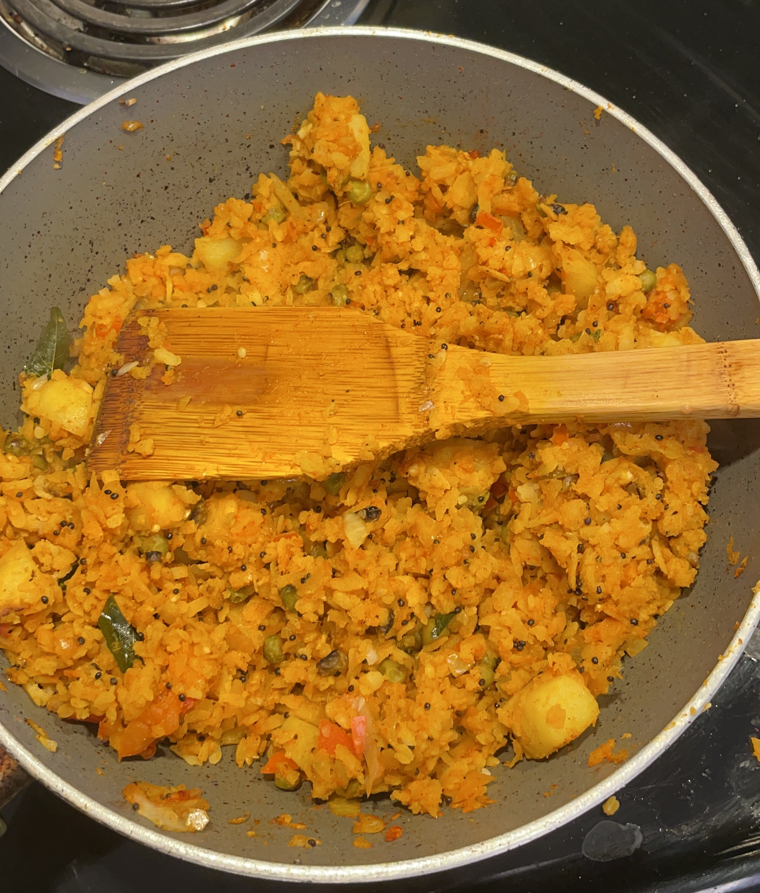
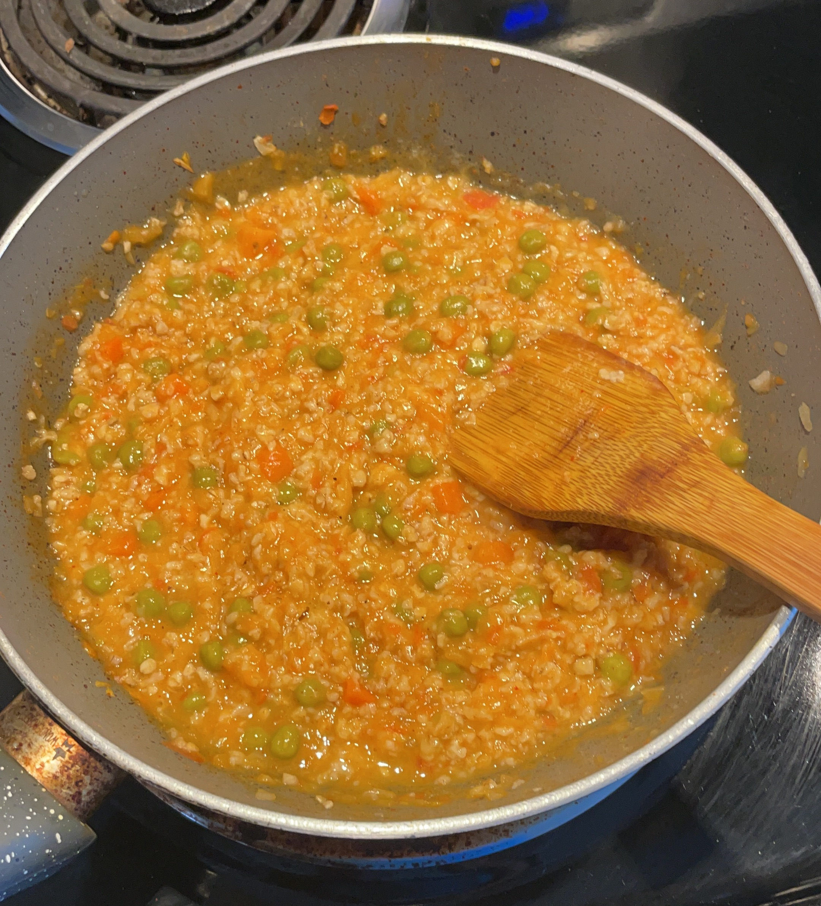
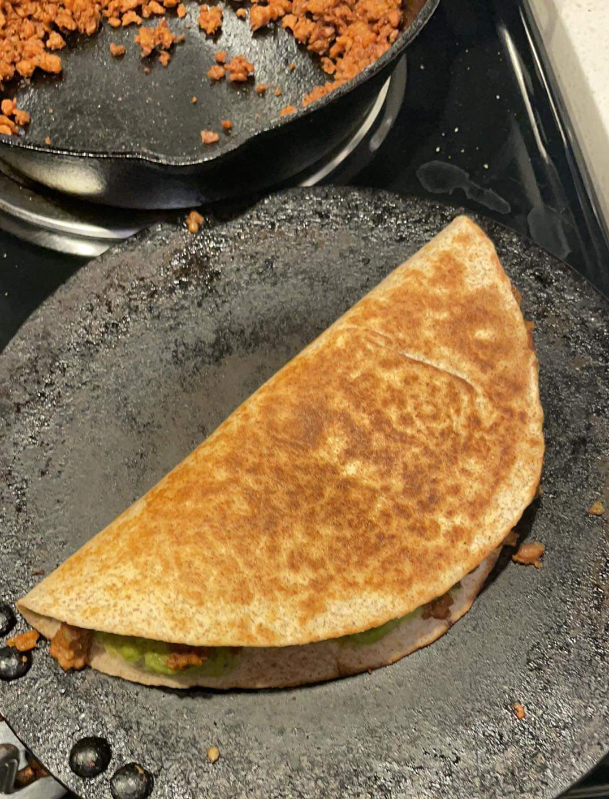

Clearly having gotten bored of the same old schedule in the past socially distanced year, I decided to spice things up by going vegan. The reason for trying veganism was knowing that it was better for the planet, I wanted to experiment whether it was better for me too. I gave myself about a week to prepare in the last week of April, and try to eat most of the remaining meats in my freezer, but as soon as the clock struck midnight on the last day of April I was vegan.

Starting off, I was commited to being fully vegan always for all my meals. This meant no milk in the house, no more eggs for breakfast, no ordering pizzas when I felt too lazy to cook. The first two really put a damper on what I could have for breakfast. After some [googling](https://www.urbandictionary.com/define.php?term=googling), and consulting my mother about what I could eat for breakfast I landed on a couple alternatives, which have kept me fed most mornings for the past month:

- [Chia seeds soaked in almond/oat milk with berries and maple syrup](https://www.eatingbirdfood.com/basic-chia-seed-pudding/#wprm-recipe-container-33190)

- [Poha (flattened rice)](https://www.indianhealthyrecipes.com/poha-recipe-kanda-batata-poha/)

- Vegetable Oats - same recipe as Poha, just w/ oats instead

- [Chickpea flour omlette](https://www.indianhealthyrecipes.com/cheela-recipe/)

- Avocado toast w/ roasted cherry tomatoes

Cutting out milk was actually easier than I expected, having had almond milk for the first week or so, and then [switching to oat milk](https://thebeet.com/youve-ditched-dairy-but-which-plant-based-milk-is-best-for-the-environment/) I saw no hinderance to my daily routine. Cutting out cheese was harder since I love mexican cuisine and quesadillas w/o cheese fall flat on the face, still I persevered on.

A side effect to my transition to veganism was that it resulted in my sugar consumption tumbling down to near zero. This was because my candy and chocolate consumption fell flat on its face since most things sweet have some milk or animal products in them. In the short run, this resulted in me feeling tired sooner. I suspect my energy will recover as I eat better since surviving on sugar highs was never the right call, but in the past month I was just napping way more frequently.

Having dealt with breakfast, I tackled lunch and dinner with my favorite vegatable of the month: potato. Potatoes were the one saving grace of veganism, extremely versatile and tasty as hell. I was having potatoes w/ everything, and sometimes just potatoes on their own, and to be fair they were the source of most my "sugars" during the month. 

Apart from potatoes, I also ended up trying beyond meat, and it was surprisingly good. It doesn't taste like the original, but does have the meaty texture, and I was indeed able to make quesadillas and nachos with it.

I even managed to make vegan garlic alfredo pasta using oat milk as the substitute, and it was pretty close to the real deal.

In the end, going vegan has been a personal achievement, but I did make some concessions during the month. Since most of my friends are not vegan, getting food together was a bit more difficult, so the concession I made was that if I am going out with friends or if its some occassion, I'd skip the veganism. Earlier I'd thought about having one day of the week as a cheat day, but that did not sit right with me since I would just be holding off on all my meats and cheese till the day arrived every week, countering the point of the whole ordeal.

So the next time we meet, I'd probably still eat the same stuff, but when I'm on my own I'll be following my vegan diet.