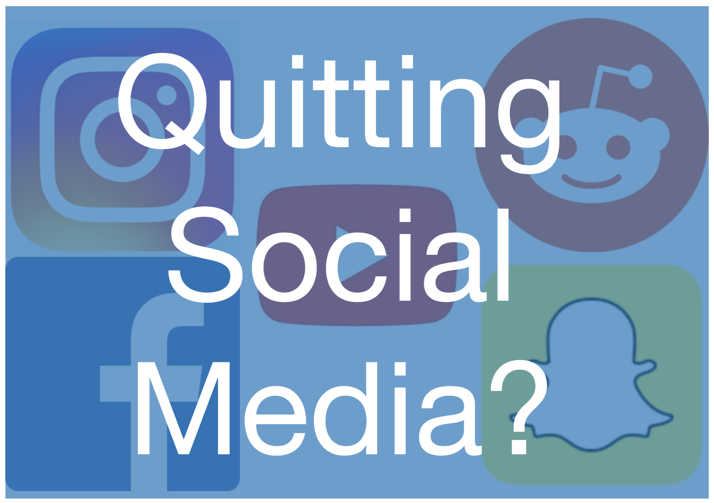
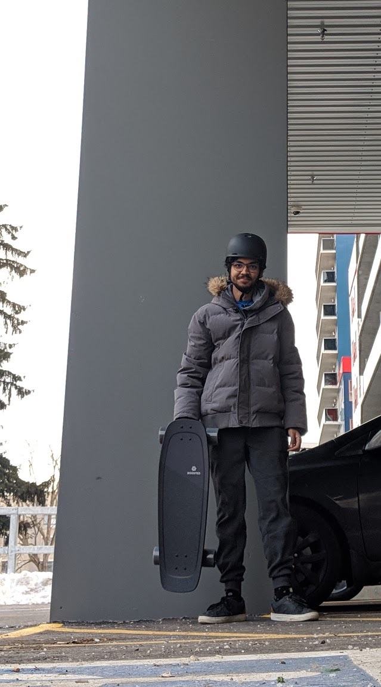

It had been about 13 hours since I deleted Instagram, Facebook, Snapchat Reddit and YouTube from my mobile phone and I almost died that day

The click bait is fun, but I think there is some attribution to the fact that I was trying to replace my thrills of life with other probably more risky situation. Or more appropriately, use the time that I had freed up to try other things that I haven't before, that are probably more risky than browsing through Instagram.

After reading Philip DeFranco’s Instagram post, watching Casey Neistat’s video and reading the linked articles in his video, I did realize that I was indeed addicted to the mindless infinite scrolling. My situation was inching to how Casey was describing his own situation.

While I watched his video, and listened to him talk about how he could not have a conversation or watch a movie without looking at his phone I thought that my situation was not as bad, but, as I reflect back, I did take out my phone while I watched Captain Marvel about 2 weeks ago, and I often can be found looking at my phone while listening to people talk. The problem was so bad, and prominent that even my mentor had pointed it out to me at work in week 2 (which at the time of writing this, was 8 weeks ago.) Being an (ir)responsible adult I switched my attention away from the mobile, and to the desktop and soon I was logged into Facebook, Youtube and Reddit all on my work laptop and was scrolling away without anybody being the wiser. On an average day, I had about an hour of Youtube use on mobile, about 40 minutes of Reddit and Facebook/Instagram each, and about 30 minutes of Snapchat (which kept pinging to keep the streaks alive)

At about 10:50pm, on 18th March 2019, I had successfully uploaded a status on Instagram stating that I was quitting all of the aforementioned and that I would be only reachable by text.

Within a minute of posting that status, a friend called me up to make sure that all was good, and all attributed to the fact that I was quitting Reddit (I have been a long time redditor, so much so that many of my friends have been trying to procure my real OG reddit username)
Within 10 minutes of the status I received another call, this time inquiring about the same, but only with more detail (since this person knew me a little bit better)

Within 15 minutes of the status, I had uninstalled Fenix for Twitter, Sync For Reddit (Pro), Messenger, Snapchat (and the attached Screen recorder for Snapchat). I also disabled the pre-installed YouTube app. (For those of you thinking that I did not uninstall Facebook, that’s because I never had the app installed in the first place and was always browsing from the mobile web browser after I heard about how clunky and creepy the tracking the app had was.) Not only did I un-install all of those websites but I also setup a local DNS blocker/proxy to stop myself from accessing these websites using my mobile browser.

Since I had saved some time not browsing through Instagram or Reddit, I was able to make time for myself to make my breakfast on a weekday (almost inching towards a miracle.) I chopped up some onions, tomatoes, and coriander as I made myself myself some tea flavored milk on the stove.

One thing that I have in common with 75% of Americans [[source]](https://www.cbsnews.com/news/survey-75-percent-of-americans-admit-to-using-phone-while-in-bathroom/), is that while I’m on the toilet, I am browsing Reddit, watching YouTube videos and scrolling through Instagram. Following the theme above, I had literally nothing to do, and was out quicker than I would like to admit.
After making myself some dope scrambled eggs I was out the door. At this point you may be thinking, when did I actually almost die. As many of you reading this may or may not know, I had bought Boosted Mini X [electric skateboard with speeds of up to 22 miles/hr] last December and have been patiently waiting for Spring to roll back so that I can rip up some streets. Any clear day in the winter, and I was out the door with my board learning and becoming better at it. Since it was such a cool thing, I had made sure to plan my Instagram story to make sure that I had a cool archive of my journey learning. Although that was a good way to keep a record of my experience, I had mostly kept up with it because it would be a way to show off the the board that unsurprisingly almost killed me that day.

Since the day was supposed to be sunny, I had decided the night before that I would for the first time ride my Boosted board to work and I did just that. This was my way to get the thrills of living vicariously without using any social media. I was trying to fill a gaping hole of time and endorphin rush that I knew would seriously affect me in the first week.

Riding the board was so much fun for the most part. Until I had to cross a railway crossing, and to no one’s surprise I went flying as soon as I hit the tracks because my wheels were just too small to cover the gap of the same. I luckily did not hit my head on the road, almost did a short Naruto run. Quickly I straightened myself up, picked up my bottle from where it had fallen on the road. I raised my hands as if to apologize to the 10 cars waiting behind me, while the lady in the car at the very front just shook her head in disdain. I picked up my boosted board lying on the road, totally inverted and stepped on the sidewalk as all the drivers gave me a look as they crossed.
Not one to give up easy, I was back on the road on my boosted board a minute after the brutal accident. Within 3 minutes of that, I had missed the turn I was supposed to take and went a kilometer in the other direction. While lost I also got scolded by the driver of a passing car to get off the road despite there being no bike lane.

Although the title might seem super click-baity, in the week after I seriously get a need to do so much extra just to get the rush of endorphins back. BUT I would not miss it for anything else. I just have so much more time on my hands and am getting back to things that I used to love, like writing blogs such as this one. Over the coming months I will try to be more up to date with all of this. I have also found time to read books, and am considering setting a time every day to keep up this habit. It hasn’t been too bad and since I have had three meals on the regular as opposed to 1.5 I cannot say I am complaining.
I have enough time to do the small things ASAP so that I do not have to clump together as one large task. I even started to listen to podcasts which was fun on the bus ride back since I could not really do anything else. I would genuinely recommend anyone reading this to take the time to take a step back and reflect on the new digital age, and take steps to control the internet addict within as I have tried myself
