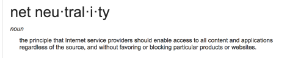
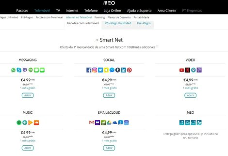

Who's right?

As you all might know from news articles from various sources, Net Neutrality is dead in the US, at least for now.
Net Neutrality as from the from the definition on google means that all content on the net is available freely and "equally" without any favoring or blocking.

As with the demise of these rules, the ISP's or Internet Service Provider, now have free rein to do what is in their favor.
This means they now have the right to censor:

- content that is against them
- content they have been paid to throttle

This also means that ISP's now have leverage against anyone that operates using the internet. They can even throttle all your favorite Netflix shows until Netflix regularly coughs up money to prevent this. This power is huge in this day and age.

ISP's can now favor one company over another. If Amazon pays the ISP more money, the ISP can ensure that more traffic is diverted to Amazon Prime Video by ensuring throttling Netflix.

Moreover, this demise will directly affect the startup culture in US. If any new startup wants to challenge a pre-existing corporation, the corporation can pay some money to the ISP to throttle the startup and squash the competition.

The business model of all the Fortune 500 companies is bound to change.

This is what the state of internet is in Portugal a country in which ISP's have found legal loopholes to skirt Net Neutrality restrictions
