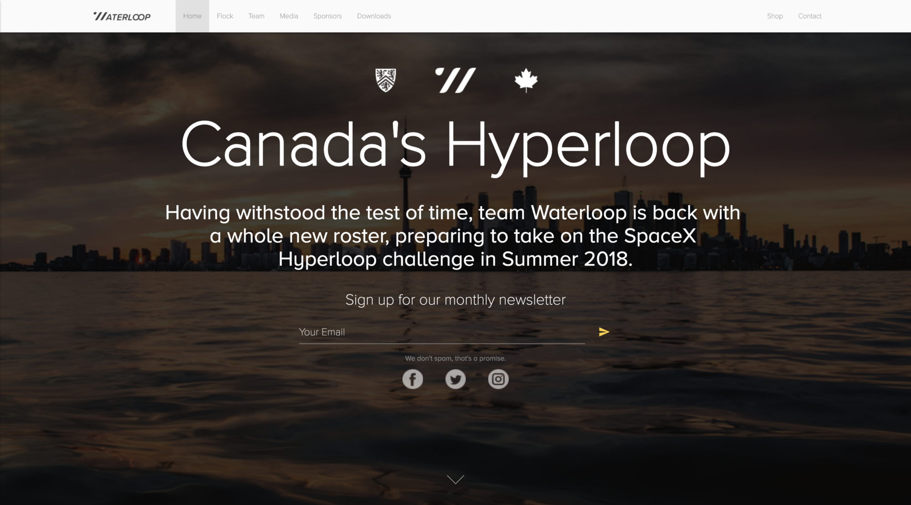
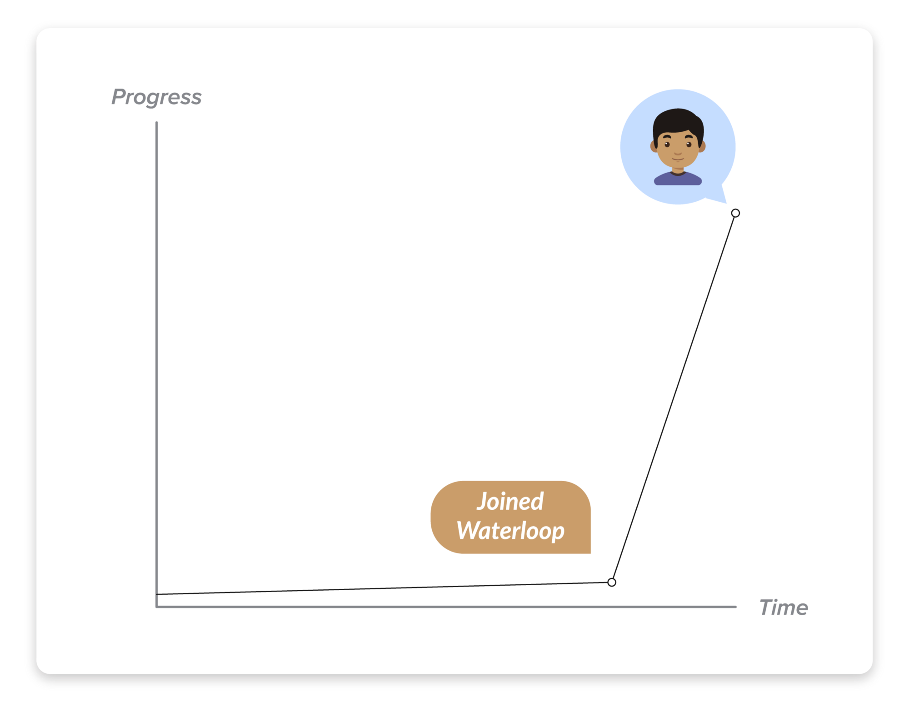
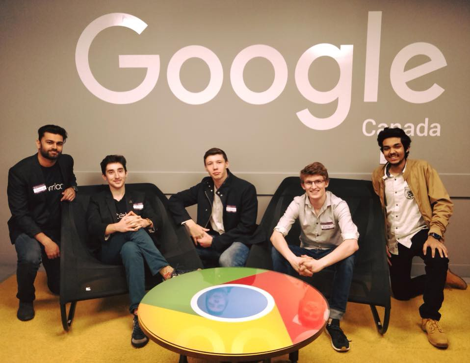
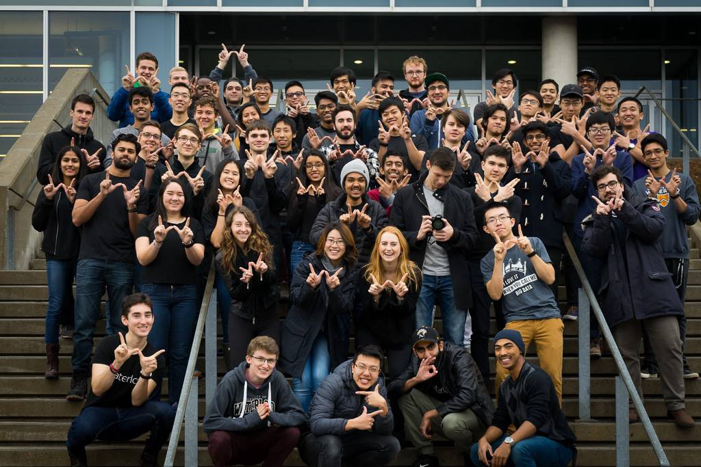

I joined Waterloop at the start of the Fall 2017 term, initially as a member of the Embedded Systems team. I then transitioned to the Web team to help build the new revamped website (which is going to be released very soon!).

## Why I Joined:

Coming from a strong academic background in India, I really wanted to challenge myself by also taking on an extra curricular activity. This desire to develop myself further resulted in me joining a student design team. I am a big Elon Musk fan, and to be given a chance to build something that was designed and thought of by him left me drooling.

The official reason I wanted to join (sourced this from my application):

> I found out about Waterloop at the Sedra Student Design Centre during orientation week and wanted to apply as soon as I could. I have fantasized about Tesla and Elon Musk in general since I was in grade 10. So much that I closely follow Tesla’s stock price and try to evaluate why the stock rises and falls when it does.
>
> But at heart I am a Software Developer and I have experience in Python, C++ along with some basic front end development and I would love to use my skills to develop the transportation of the future as imagined by Elon Musk.

## My Journey So Far:

As a student design team, Waterloop is super organized in terms of roles of different sub teams and its respective members. As a student in my first term at university, it was the best way for me to gain hands on experience.

My experience on the team has been amazing! Although I started out as a member of the web team, I quickly learned the ropes and graduated to the role of lead of the subteam with the help of all my other team members. This term our task, which was quite daunting, was to create a website from scratch. Honestly, this task was huge for a team of 5 developers when we started off.

The initial step after designing the wireframes of the website (thanks Emile Patry!), was to decide on what framework we were going to use for the actual implementation. After some debates and discussion over using react, we decided to roll with EJS templating.

Once the framework was decided, no one wanted to be the one to start the project since no one knew where to even start this huge project. Slowly, everyone started to warm up to the idea that the project was feasible. Eventually, parts of the website began to come together such as the navigation bar, the footer and some actual content on the front page.

Everyone on the team was then assigned pages to work on and things started to evolve from being bland text boxes, to pages with styled sections.

One major issue that we faced was using the desktop wireframes to derive the mobile wireframes. We had to deal with overflowing text, non-resizable elements on the page, and a totally different navigation bar for mobile while still maintaining the intuitiveness of the navigation bar on the desktop.

We pushed through these challenges and some more and were able to come out strong. We perfected our front-end skills as a team and launched a product that we are extremely proud of, and one that our sponsors will be proud of too.

I have learned so many new things over the course of these 16 weeks. Here is a quick graph that represents my transition:

I learned how to use development tools on chrome to debug websites properly (thanks Ruslan Nikolaev!), templating in C++ as part of my brief stint in the Embedded Systems team (thanks Deep Dhillon!) and how to network with people (thanks Nicholas Jelich!).

This experience taught me that a top-notch elevator pitch could make or break someone’s interest in your idea. It also introduced me to what new things people are exploring in technology.

---

Overall, I am super hyped to be on the team and can’t wait to see our new pod at Competition 3.
